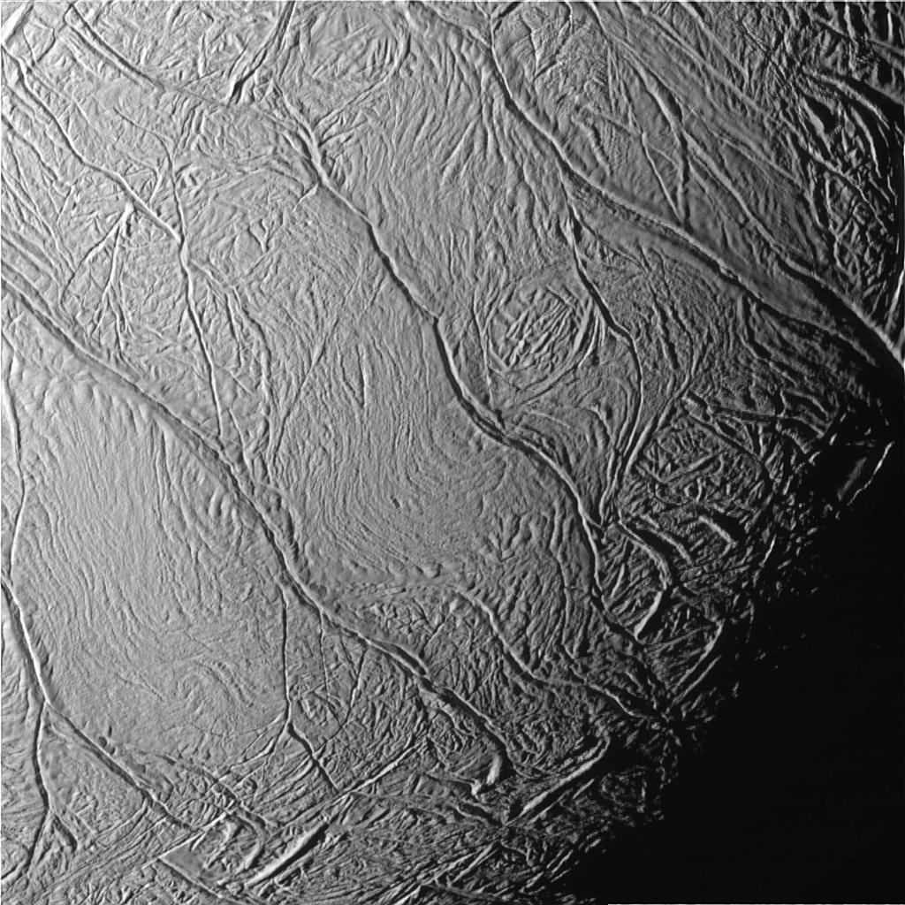
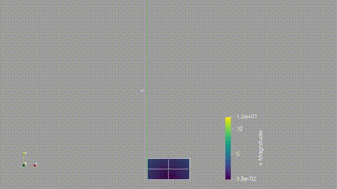
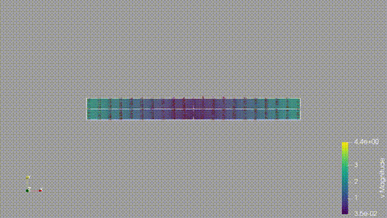

# Hydraulic Enceladus
This project aims to simulate a very simplified evolution of the water level of the subsurface ocean of Enceladus.

## Motivation

* **Enceladus**, one of Saturn's moons, hides a subsurface ocean beneath an ice shell. 

* So-called *Tiger stripes* (i.e., cracks in the ice shell at the south pole) *eject* plumes of water vapor and ice grains into space — **how?**

* Saturn exerts **tidal forces** on Enceladus → ice shell squeezes and stretches → the water in the cracks gets displaced. 

* Since the orbit is periodic, the motion of the ice shell is cyclic as well.

 

_<small>Tiger stripes. [Source: NASA/JPL](http://photojournal.jpl.nasa.gov/catalog/PIA06247)</small>_

## Results sneak peek

## Results Sneak Peek

| ** Global view ** | **Detailed view** |
| :---: | :---: |
|  |  |
| *Evolution of the free surface* | *Velocity field and mesh distortion* |

# References
- [Souček, O., Běhounková, M., Lanzendörfer, M. et al. Variations in plume activity reveal the dynamics of water-filled faults on Enceladus. Nat Commun 15, 7405 (2024).](https://doi.org/10.1038/s41467-024-51677-z)

